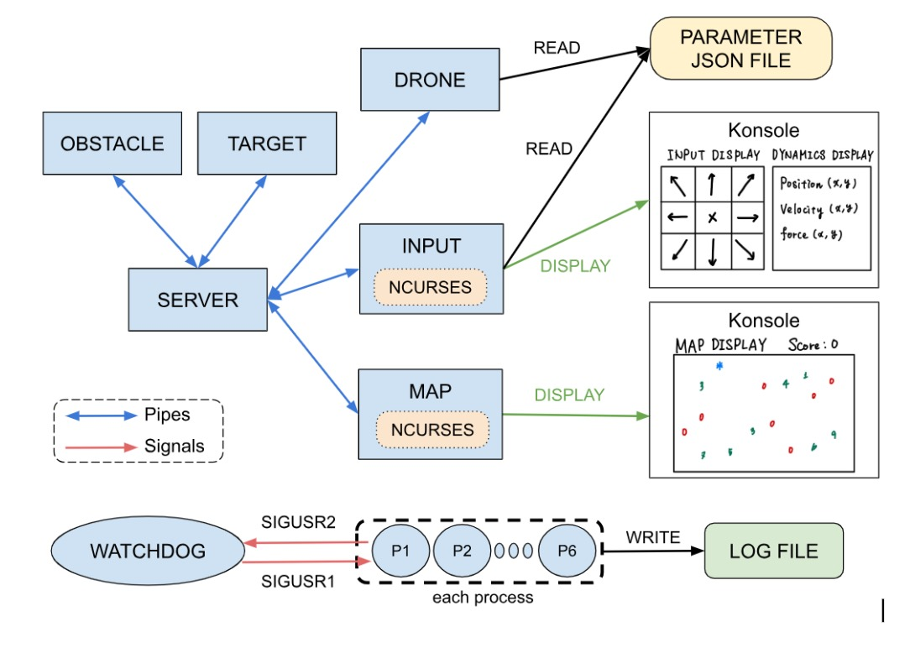

# ARP_assignments

# Authors

Yui MOMIYAMA

Paul PHAM DANG

Group 3

## How to run

### Dependencies

These dependencies are needed:

- make
- CMake version > 3.10
- libncurses

    sudo apt install libncurses5-dev

- lib cjson

    sudo apt install libcjson-dev

The assignment has been tried using Ubuntu 22.04

### Run the assignments

Simply execute the scripts by executing:

For the assignment 1 :

    ./run_assignment1.sh

For assignment 2 :

    ./run_assignment2.sh

To change from assignment 1 and 2, you can do

    git checkout <assignment>

There are two branches :
main is assignment 1 and assignment2 is for assignment 2.
If you use the script it will automatically change to the right branch

## Rules of the game

### Control

```bash

Movement Keys:      Exit Key:
-------------                 
| Q | W | E |                  
-------------         ---    
| A | S | D |   ---> | P |   
-------------         ---     
| Z | X | C |                  
-------------  

```

The eight external keys allow the user to control the drone by applying force in the corresponding direction (up, up-right, right, etc.). Meanwhile, pressing the `s` key immediately nullifies all forces. The spacebar functions identically to the 'S' key. Finally, pressing the 'P' key ensures a safe shutdown of the program.

Please note the following points:

- For these controls to work, the Input window must be selected when it appears.
- Use an English keyboard to control the drone.

### Score Increment Rules

The score is updated based on the following conditions.

- **If \( t <= 30 \):**
  - If the target number is 1:  
    `score_increment = 4 + (30 - t)`
  - If the target number is not 1:  
    `score_increment = 2`
- **If \( t > 30 \):**
  - If the target number is 1:  
    `score_increment = 4`
  - If the target number is not 1:  
    `score_increment = 2`

### Penalty Rules

- **If the player hits a wall:**  
  The score is decreased by 1:  
  `score_decrement = 1`

Summary table of the scoring rules is shown below.

| Condition        | Target Number | Score Change         |
|------------------|---------------|----------------------|
|  t < 30      | 1             | 4 + (30 - t)   |
|  t < 30      | Not 1         | +2       |
|  t >= 30  | 1             | +4              |
|  t >= 30  | Not 1         | +2              |
| Hit a wall       | -             | -1              |

This ensures that:

- Hitting a new target quickly rewards the player more when the target number is 1.
- All other target hits follow a fixed increment.
- Hitting a wall results in a penalty, reducing the score by 1.

## Technical notes

### Software architecture of the first assignment



### Active components

The active components of this project are:

- Server
- Map
- Drone
- Input
- Watchdog
- Target
- Obstacle

They are all launch by the master process

For the first assignment, all the files are written in C. And we compile using cmake with `CMakeLists.txt` files

#### Server

The server manages a blackboard with the geometrical state of the world (map, drone, targets, obstacles…). The server read from the pipes coming from the processes and send to the data to other processes. Moreover, it also "fork" the **map** process. Data from pipes can be identified by a capital letter at the beginning of the message. For example, a message starting with "TH" means that a Target has been hit and the following is the coordinate of this target.

#### Map

The **map** process display using ncurses the drone, targets and obstacles. All the data are coming through the pipe from the server. This process also compute the score of the user.

In the map window, the updated score and messages regarding the scoring rule are shown at the top right.

#### Drone

The code processes incoming messages to update obstacle data, target and drone force components, then calculates the total force from the repulsive forces from obstacles and from the walls, the attractive force from the targets and the user input force. The external forces activate only if they are close to the object. We used the
Latombe / Kathib’s model for the external forces using a lot of dynamic parameters defined in the `drone_parameters.json` file.

#### Input

The input module receives user commands from the keyboard and determines the forces currently acting on the drone based on these inputs. These computed forces are then transmitted to the server via a pipe, making them accessible to the drone process, which utilizes them to calculate its dynamics. Additionally, the input module is responsible for displaying various drone parameters, including position, velocity, and applied forces. If the `p` key is pressed, the input module sends a `STOP` signal to ensure all processes are safely terminated.

#### Watchdog

The Watchdog send `SIGUSR1` to all the processes to check if they responds. All the other processes have a signal handler which send `SIGUSR2` to the Watchdog when they receive `SIGUSR1`. The code sets up a signal handler for`SIGUSR2` to increment `response_count` when the signal is received. In the `main` function, it initializes the signal handler, verifies the correct number of command-line arguments, and parses PIDs for various processes, storing them in appropriate variables. If we don't receive the signal from a process, we send a signal to kill all the processes.

#### Target

The code initializes a target generation process, validates input arguments, and communicates with a server by sending randomly generated target positions. It continuously generates and sends target data until a "STOP" signal is received, then performs cleanup and exits.

#### Obstacle

The code initializes an obstacle generation process and send random obstacle positions to the server, using pipes for communication. It continuously generates obstacle data every `OBSTACLES_SPAWN_PERIOD`, sends it to the server, and handles server responses until a "STOP" signal is received, then performs cleanup and exits.

#### Master

The code initializes the master process, creates a log file, creates all the pipes, execute all the processes and closed useless pipes for each process. It's the father of all the other processes. It's the executable we will execute to run the whole simulation.

### Other files

The other main files of this project are:

- wrappers
- utility
- constant
- droneDataStructs
- drone_parameters.json

#### wrappers

The `wrappers.c` file provides custom wrapper functions for system calls, enhancing them with detailed error handling and logging. These functions ensure robust error reporting and graceful program termination in case of failures. In all of the functions, if an error occurs, the message is added to the log file. The function name are the same as the classical system call function but with an initial capital letter.

#### utility

The `utility.c` file provides various utility functions, such as reading configuration parameters from a JSON file, tokenizing strings, a max function... These functions support the main program by handling common tasks and simplifying code reuse.

#### constant

The `constants.h` file defines essential constants and macros used throughout the project, such as file paths, simulation dimensions, and limits for various parameters.

#### droneDataStructs

The `droneDataStructs.h` file defines key data structures of force, pos, and velocity, used to represent the drone's physical properties.

#### drone_parameters.json

The `drone_parameters.json` file provides configuration settings for the drone simulation, including parameters for the drone's physical properties and input controls. It allows for easy adjustment and tuning of simulation behavior through a structured JSON format DURING THE SIMULATION. So we don't have to recompile to change a parameter unlike the constants in `constant.h`.

### Remark

It can happen that there is an error with a broken pipe if you close badly the project... It it happens, restart your computer and it will solve the issue :)
